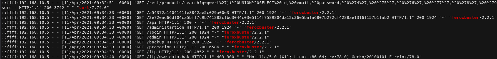

[THM-ROOM](https://tryhackme.com/room/juicydetails) 

#### ABOUT THE ROOM

Você foi contratado como Analista de SOC para uma das maiores Juice Shops do mundo e um invasor entrou em sua rede.

Suas tarefas são:

- Descobrir quais técnicas e ferramentas o invasor usou
- Quais endpoints eram vulneráveis
- Quais dados confidenciais foram acessados ​​e roubados do ambiente

Uma equipe de TI enviou a você um arquivo zip contendo logs do servidor. Baixe o arquivo anexado, digite "Estou pronto!" e mãos à obra! Não há tempo a perder!

----

#### RECONHECIMENTO 
Ao analisar os arquivos enviados pela equipe que contém os logs de acesso, autenticação e de vsftpd(ftp unix) do servidor, foi possível identificar que o atacante utilizou-se de ferramentas conhecidas para obter acesso ao servidor. 

O ataque iniciou com um mapeamento da rede  utilizando a ferramenta Nmap para identifação de portas abertas no servidor, como pode-se verificar na imagem abaixo. 

Posteriormente, é possível identificar ver várias requisições POST proviniente da ferramenta Hydra para realizar uma quebra de senha no endpoint "/rest/user/login" e por fim, conseguindo acesso às 09:16:31. 

Com credenciais de login em mãos, o atacante forçou várias requições de SQLInjection na busca de produtos "/rest/products/search" utilizando o parâmetro "q", e assim, conseguindo acesso à tabela de usuários, contendo email e senha, pela sessão de análises de produtos do site, conforme abaixo.

E por fim, utilizou-se do curl para realizar transferir os dados obtidos através pelo SQLMap, em seguida, realizou um mapeamento de diretórios usando a ferramenta feroxbuster.

----

#### DADOS ROUBADOS

Com este ataque ao Juicy, o atacante conseguiu obter credenciais de usuários, ter acesso à máquina via SSH no usuario "www-data", efetuar download de dois arquivos de backup que estavam em um endpoint vulnerável utilizando FTP com usuario anonymous. 

