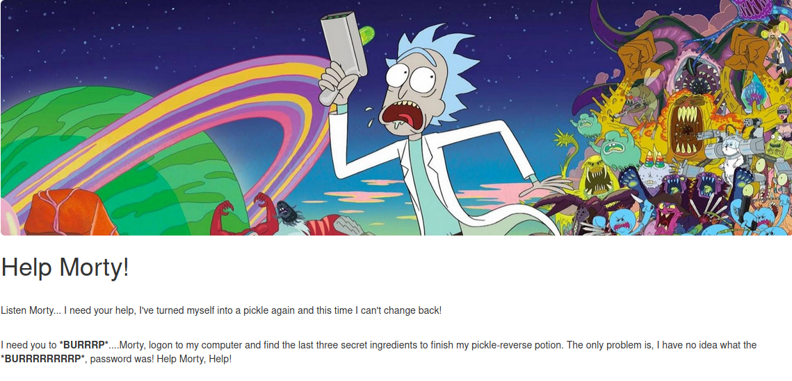
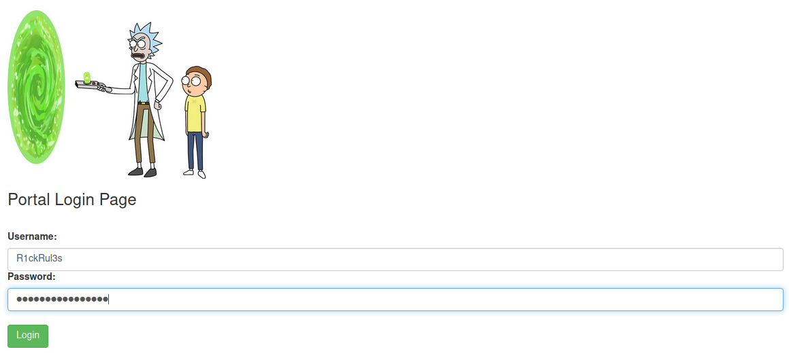
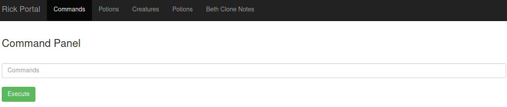
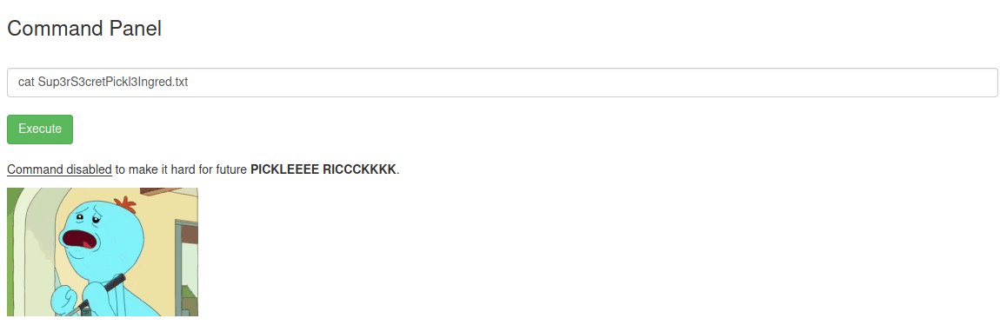
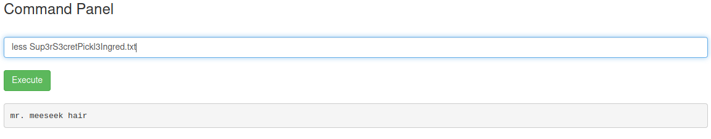
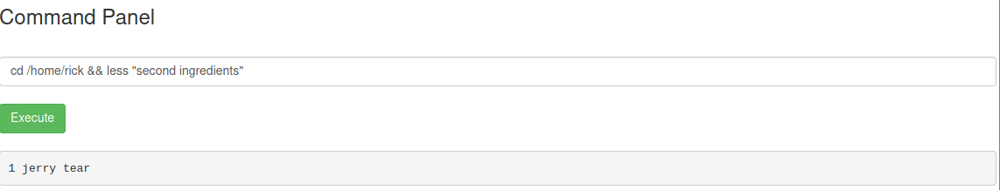
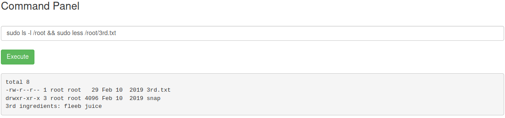

[THM-ROOM](https://tryhackme.com/room/picklerick) - <span style="color:green">PICKLERICK</span>
---
##### ABOUT THE ROOM
This Rick and Morty themed challenge requires you to exploit a webserver to find 3 ingredients that will help Rick make his potion to transform himself back into a human from a pickle
##### TASK
Find _3 Flags (ingredients)_
- What is the first ingredient Rick needs?
- Whats the second ingredient Rick needs?
- Whats the final ingredient Rick needs?]
#####IP: 10.10.230.33
┌──(gh0st㉿shell)-[~/THM/picklerick]
└─$ export inetip=10.10.230.33

---

##### SCAN
~~~
┌──(gh0st㉿shell)-[~/THM/picklerick]
└─$  nmap -sC -sV -on $inetip
\# Nmap 7.91 scan initiated Sun May 23 07:38:56 2021 as: nmap -sC -sV -on 10.10.230.33
Nmap scan report for 10.10.230.33
Host is up (0.22s latency).
Not shown: 998 closed ports
PORT   STATE SERVICE VERSION
22/tcp open  ssh     OpenSSH 7.2p2 Ubuntu 4ubuntu2.6 (Ubuntu Linux; protocol 2.0)
| ssh-hostkey: 
|   2048 b1:59:05:46:0b:bc:ba:52:72:46:8d:00:0d:11:42:2b (RSA)
|   256 98:85:44:cd:41:2b:31:8d:07:70:f0:d3:0b:1a:9d:d5 (ECDSA)
|_  256 be:be:3a:13:3e:3c:d5:23:5b:0b:9f:c5:3e:a7:00:0a (ED25519)
80/tcp open  http    Apache httpd 2.4.18 ((Ubuntu))
|_http-server-header: Apache/2.4.18 (Ubuntu)
|_http-title: Rick is sup4r cool
Service Info: OS: Linux; CPE: cpe:/o:linux:linux_kernel

Service detection performed. Please report any incorrect results at https://nmap.org/submit/ .
\# Nmap done at Sun May 23 07:39:43 2021 -- 1 IP address (1 host up) scanned in 47.06 seconds
~~~
Scanning __$inetip__ we found 2 opened ports:
22/tcp open SSH
80/tcp open HTTP

OS: Linux
Server: Apache/2.4.18 (Ubuntu)

Let's do a GET request to __$inetip__ using __curl__

#### CURL #1
~~~
┌──(gh0st㉿shell)-[~/THM/picklerick]
└─$ curl -i $inetip          
HTTP/1.1 200 OK
Date: Sun, 23 May 2021 12:00:30 GMT
Server: Apache/2.4.18 (Ubuntu)
Last-Modified: Sun, 10 Feb 2019 16:37:33 GMT
ETag: "426-5818ccf125686"
Accept-Ranges: bytes
Content-Length: 1062
Vary: Accept-Encoding
Content-Type: text/html
<!DOCTYPE html>
<html lang="en">
<head>
  <title>Rick is sup4r cool</title>
  <meta charset="utf-8">
  <meta name="viewport" content="width=device-width, initial-scale=1">
  <link rel="stylesheet" href="assets/bootstrap.min.css">
  <script src="assets/jquery.min.js"></script>
  <script src="assets/bootstrap.min.js"></script>
  <style>
  .jumbotron {
    background-image: url("assets/rickandmorty.jpeg");
    background-size: cover;
    height: 340px;
  }
  </style>
</head>
<body>
  <div class="container">
    <div class="jumbotron"></div>
    <h1>Help Morty!</h1></br>
    <p>Listen Morty... I need your help, I've turned myself into a pickle again and this time I can't change back!</p></br>
    <p>I need you to <b>*BURRRP*</b>....Morty, logon to my computer and find the last three secret ingredients to finish my pickle-reverse potion. The only problem is,
    I have no idea what the <b>*BURRRRRRRRP*</b>, password was! Help Morty, Help!</p></br>
  </div>
  <!--
    Note to self, remember username!
    Username: R1ckRul3s
  -->
</body>
</html>
~~~

Analising the response to our GET request, we can see a Username: __R1ckRul3s__ commented on the html body's bottom. We'll needthis user later

Ok, we are in the http://10.10.230.23/ and there's no more info that we can use anymore.

#### GOBUSTER

Using Gobuster, let's try a bruteforce using a common wordlist in http://10.10.230.23/ to find directories/files.

~~~
┌──(gh0st㉿shell)-[~/THM/picklerick]
└─$ gobuster dir -u $inetip -w /usr/share/wordlists/dirb/common.txt
\===============================================================
Gobuster v3.1.0
by OJ Reeves (@TheColonial) & Christian Mehlmauer (@firefart)
\===============================================================
[+] Url:                     http://10.10.230.33
[+] Method:                  GET
[+] Threads:                 10
[+] Wordlist:                /usr/share/wordlists/dirb/common.txt
[+] Negative Status codes:   404
[+] User Agent:              gobuster/3.1.0
[+] Timeout:                 10s
\===============================================================
2021/05/23 07:56:19 Starting gobuster in directory enumeration mode
\===============================================================
/.hta                 (Status: 403) [Size: 291]
/.htpasswd            (Status: 403) [Size: 296]
/.htaccess            (Status: 403) [Size: 296]
/assets               (Status: 301) [Size: 313] [--> http://10.10.230.33/assets/]
/index.html           (Status: 200) [Size: 1062]                                 
/robots.txt           (Status: 200) [Size: 17]                                   
/server-status        (Status: 403) [Size: 300]                                  
                                                                                 
\===============================================================
2021/05/23 07:58:01 Finished
\===============================================================
~~~

#### CURL #2
There's a robots.txt in / folder. As before, let's do a GET request to see what we got there using curl again

~~~
┌──(gh0st㉿shell)-[~]
└─$ curl -i 10.10.154.98/robots.txt         
HTTP/1.1 200 OK
Date: Sun, 23 May 2021 17:06:11 GMT
Server: Apache/2.4.18 (Ubuntu)
Last-Modified: Sun, 10 Feb 2019 16:37:33 GMT
ETag: "11-5818ccf15f066"
Accept-Ranges: bytes
Content-Length: 17
Content-Type: text/plain

Wubbalubbadubdub
~~~

The GET response has a weirdo string for a robots.txt. Let's keep it
robots.txt: __Wubbalubbadubdub__
Now, we have to find out a way to login.

#### DIRBUSTER 

Let's try using dirbuster with -l flag to select the a small wordlist provided by dirbuster  
~~~
┌──(gh0st㉿shell)-[~/THM/picklerick]
└─$ dirbuster -r 10.10.230.33 -l /usr/share/wordlist/dirbuster/directory-list-2.3-small.txt
Picked up _JAVA_OPTIONS: -Dawt.useSystemAAFontSettings=on -Dswing.aatext=true
DirBuster: option requires an argument -- l
Starting OWASP DirBuster 1.0-RC1
Starting dir/file list based brute forcing
File found: /portal.php - 302
File found: /login.php - 200
Dir found: / -Dir found: /icons/ - 403
Dir found: /assets/ - 200
File found: /assets/jquery.min.js - 200
File found: /assets/bootstrap.min.css - 200
File found: /assets/bootstrap.min.js - 200
Dir found: /icons/small/ - 403
DirBuster Stopped
~~~
#### LOGIN
Okay, we got 2 php pages, portal and login.
Let's try out to login using what we got atm

```
Login credentials
User: R1ckRul3s 
Pass: Wubbalubbadubdub
```

And then, we're in

#### FIRST FLAG
> __ls -lha; pwd__ # on the command panel input, to se what files we got in the current directory, permissions and where we are using pwd
total 40K
drwxr-xr-x 3 root   root   4.0K Feb 10  2019 .
drwxr-xr-x 3 root   root   4.0K Feb 10  2019 ..
-rwxr-xr-x 1 ubuntu ubuntu   17 Feb 10  2019 Sup3rS3cretPickl3Ingred.txt
drwxrwxr-x 2 ubuntu ubuntu 4.0K Feb 10  2019 assets
-rwxr-xr-x 1 ubuntu ubuntu   54 Feb 10  2019 clue.txt
-rwxr-xr-x 1 ubuntu ubuntu 1.1K Feb 10  2019 denied.php
-rwxrwxrwx 1 ubuntu ubuntu 1.1K Feb 10  2019 index.html
-rwxr-xr-x 1 ubuntu ubuntu 1.5K Feb 10  2019 login.php
-rwxr-xr-x 1 ubuntu ubuntu 2.0K Feb 10  2019 portal.php
-rwxr-xr-x 1 ubuntu ubuntu   17 Feb 10  2019 robots.txt
/var/www/html
The file __Sup3rS3cretPickl3Ingred.txt__ seems to be promising, let's try use cat command to see the raw text.
> __cat__ Sup3rS3cretPickl3Ingred.txt


As you can see, cat command is blocked :( 
Let's try with __less__ command

> __less Sup3rS3cretPickl3Ingred.txt__


Then we capture the first ingredient that Rick needs.
Let's find out the second ingredient 

#### SECOND FLAG

As we can see before, we are in __/var/www/html__, under 3 folders inside the __'/'__, let's go up them to '__/__' path
> __cd ../../../../ && ls -lha && pwd && dir__  # Now we are in the '__/__' folder, we can se the permissions, files, directories. 
total 88K
drwxr-xr-x  23 root root 4.0K May 23 17:05 .
drwxr-xr-x  23 root root 4.0K May 23 17:05 ..
drwxr-xr-x   2 root root 4.0K Nov 14  2018 bin
drwxr-xr-x   3 root root 4.0K Nov 14  2018 boot
drwxr-xr-x  14 root root 3.2K May 23 17:05 dev
drwxr-xr-x  94 root root 4.0K May 23 17:05 etc
drwxr-xr-x   4 root root 4.0K Feb 10  2019 home
lrwxrwxrwx   1 root root   30 Nov 14  2018 initrd.img -> boot/initrd.img-4.4.0-1072-aws
drwxr-xr-x  21 root root 4.0K Feb 10  2019 lib
drwxr-xr-x   2 root root 4.0K Nov 14  2018 lib64
drwx------   2 root root  16K Nov 14  2018 lost+found
drwxr-xr-x   2 root root 4.0K Nov 14  2018 media
drwxr-xr-x   2 root root 4.0K Nov 14  2018 mnt
drwxr-xr-x   2 root root 4.0K Nov 14  2018 opt
dr-xr-xr-x 135 root root    0 May 23 17:05 proc
drwx------   4 root root 4.0K Feb 10  2019 root
drwxr-xr-x  25 root root  880 May 23 17:05 run
drwxr-xr-x   2 root root 4.0K Nov 14  2018 sbin
drwxr-xr-x   5 root root 4.0K Feb 10  2019 snap
drwxr-xr-x   2 root root 4.0K Nov 14  2018 srv
dr-xr-xr-x  13 root root    0 May 23 17:05 sys
drwxrwxrwt   8 root root 4.0K May 23 17:39 tmp
drwxr-xr-x  10 root root 4.0K Nov 14  2018 usr
drwxr-xr-x  14 root root 4.0K Feb 10  2019 var
lrwxrwxrwx   1 root root   27 Nov 14  2018 vmlinuz -> boot/vmlinuz-4.4.0-1072-aws
/
bin   etc	  lib	      media  proc  sbin  sys  var
boot  home	  lib64       mnt    root  snap  tmp  vmlinuz
dev   initrd.img  lost+found  opt    run   srv	 usr
/

Let's go to __/home/__ to se what and how many users we got in the machine
>__cd /home && ls__
drwxrwxrwx 2 root   root   4096 Feb 10  2019 rick
drwxr-xr-x 4 ubuntu ubuntu 4096 Feb 10  2019 ubuntu

The machine has a user named Rick. Now, we're going into __/rick__ folder to wee what we can obtain in his user
> __cd /home/rick && ls -lha__
total 12K
drwxrwxrwx 2 root root 4.0K Feb 10  2019 .
drwxr-xr-x 4 root root 4.0K Feb 10  2019 ..
-rwxrwxrwx 1 root root   13 Feb 10  2019 second ingredients

We already know that __cat__ command is blocked :(, lets try with less command again
> __cd /home/rick && less "second ingredients"__


Gzzz, we captured the second Flag/ingredient that Rick needs. Let's find out the last flag.


#### THIRD FLAG
Normally, flags are stored in txt, then, we'll find every ".txt" extension, let's find out all .txt taht the machine has with __sudo__ perm.
> __sudo find / -name "*.txt"__

As response from the server, we can see a file named __3rd.txt__. let's see what's stored there

> __sudo ls -l /root && sudo less /root/3rd.txt__


We've reached the third ingredient that rick needs. Now it's just register the flags/ingredients to THM and terminate the Room.